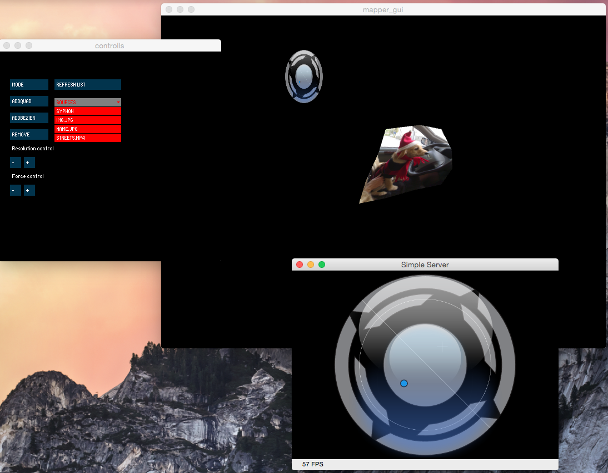

#Simple Projection Mapping Tool for Processing

Simple prjection mapping editor in Processing inspired by [Madmapper].

#####Envrionment 
* [Processing]
* tested with version 2.2.1 on OSX

#####Current Features
* Separate Control Window
* Input Selection - Image(png,jpg), Video(mp4) & Syphon
* Automatically lodaing media files from Data folder
* manual media files list refresh 

#####Usage
* Click anywhere on Main screen
* Click "AddQUAD" / "ADDBEZIER" button
* Click one of input sources from the red colored list
* Click one of Surfaces from the Main Window & Click "remove" from the Control Window
* Click "Mode" or hit Space bar to toggle Presentation / Edit mode
* Click "Refresh List" button to refresh "data" folder loading
* "Resolution Control" & "Force Control" only works for Bezier type surfaces

#####Screenshot

#####Version
1.0.0

#####Dependencies/Processing Library
* [VMAP]
* [ControlP5]
* [Syphon]

### Todo's
* Dynamic List for Syphon Input
* Auto Refresh
* File Drag&Drop 

License
----

**Freel free to mess around.**
[Madmapper]:http://www.madmapper.com/
[Processing]:http://processing.org
[vmap]:https://github.com/AlanChatham/VMap/releases
[ControlP5]:http://www.sojamo.de/libraries/controlP5/
[Syphon]:https://github.com/Syphon/Processing/releases
